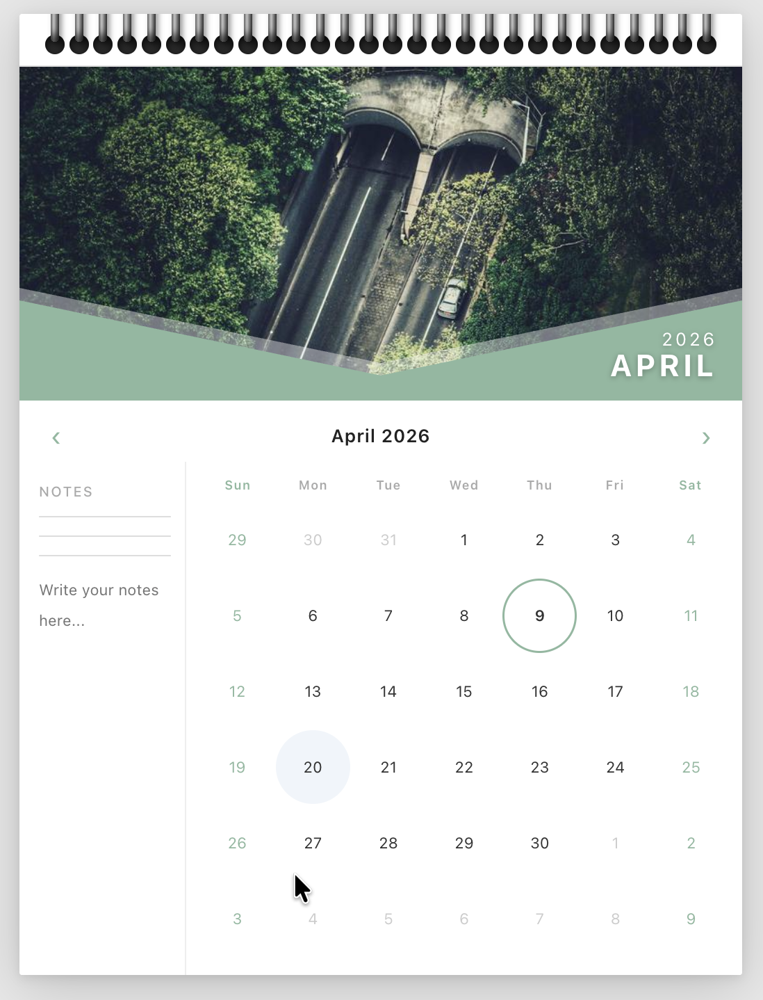

# Wall Calendar — Interactive React Component

A polished, interactive wall calendar component built with Next.js. Features a physical wall calendar aesthetic with a hero image, spiral binding, diagonal blue panel, date range selection, and integrated notes — fully responsive across desktop and mobile.

---

## Preview



> Dark moody background · Realistic spiral binding · Diagonal blue month badge · Smooth page-flip animation · Range date selection with visual states

---

## Features

- **Wall calendar aesthetic** — spiral binding, hero photo, angled blue month badge, notes ruled lines
- **Month hero images** — unique Unsplash photo per month, fades on transition
- **Date range selection** — click start date, click end date; clear visual states for start, end, in-between, and hover preview
- **Integrated notes** — ruled notepad area tied to the selected date range
- **Page-flip animation** — 3D perspective flip on month navigation
- **Fully responsive** — side-by-side desktop layout collapses to stacked mobile layout
- **No backend** — all state managed client-side with React `useState`

---

## Tech Stack

- **Framework** — Next.js 14 (App Router)
- **Language** — JavaScript (no TypeScript)
- **Styling** — Plain CSS (`Calendar.css`) — no Tailwind, no CSS-in-JS
- **Images** — Unsplash (no API key required, direct URL)
- **State** — React `useState` only, no external state library

---

## Project Structure

```
wall-calendar/
├── app/
│   ├── page.js               # Root page — holds all shared state
│   ├── layout.js             # Root layout
│   └── globals.css           # Global reset and CSS variables
├── components/
│   └── Calendar/
│       ├── Calendar.js       # Shell — layout and prop forwarding
│       ├── Calendar.css      # All calendar styles
│       ├── CalendarHeader.js # Spiral bar + month/year navigation
│       ├── CalendarGrid.js   # Date grid with range selection logic
│       ├── HeroImage.js      # Hero photo + chevron overlay + month badge
│       └── Notes.js          # Ruled notes area with date range label
├── public/
│   └── preview.png
├── package.json
└── README.md
```

---

## Getting Started

### Prerequisites

- Node.js 18 or higher
- npm 9 or higher

### Installation

```bash
# 1. Clone the repository
git clone https://github.com/your-username/wall-calendar.git
cd wall-calendar

# 2. Install dependencies
npm install

# 3. Start the development server
npm run dev
```

Open [http://localhost:3000](http://localhost:3000) in your browser.

### Build for production

```bash
npm run build
npm start
```

---

## Component Architecture

### `app/page.js`
Owns all shared state. No logic — pure state wiring and prop passing.

```
State held here:
  currentDate    → Date object for the displayed month
  selectedStart  → start of the selected range (Date | null)
  selectedEnd    → end of the selected range (Date | null)
  notes          → string content of the notes textarea
  hoveredDate    → date under cursor for preview highlight
```

### `Calendar.js`
Layout shell. Two-panel flex row on desktop, stacked column on mobile. Imports `Calendar.css`. Forwards props to all children.

### `CalendarHeader.js`
Renders the spiral bar (22 three-part coil divs built in JS) and the month/year navigation row with prev/next buttons.

### `HeroImage.js`
Renders the hero `` (keyed to `currentMonth` so React swaps it on change), the inline SVG diagonal overlay, and the angled blue month badge using `clip-path: polygon(...)`.

### `CalendarGrid.js`
Core logic component.

- `getCalendarDays(year, month)` — builds a 42-cell array (6 weeks) padded with prev/next month days
- Click logic — single click sets start; second click sets end (auto-swaps if end < start); third click resets
- CSS class assignment per cell — `other-month`, `weekend`, `today`, `selected-start`, `selected-end`, `in-range`, `range-left`, `range-right`
- `range-left` / `range-right` assigned when `index % 7 === 0` or `=== 6` to cap the highlight with half-circle ends

### `Notes.js`
Controlled `<textarea>` bound to `notes` state. Shows selected range label if both dates are set. 500-character limit with live counter.

---

## Date Range Selection Logic

```
Click 1  →  set selectedStart, clear selectedEnd
Click 2  →  set selectedEnd
           if clicked date < selectedStart → swap them
Click 3  →  reset, set new selectedStart
```

Range preview on hover is driven by `hoveredDate` — cells between `selectedStart` and `hoveredDate` get `in-range` class before the user picks an end date.

---

## Styling Decisions

| Decision | Reason |
|---|---|
| Dark `#1a1a2e` page background | Makes the white calendar card pop like a physical object on a wall |
| Multi-layer `box-shadow` on card | Simulates realistic depth — ambient + directional + contact shadow |
| `clip-path: polygon(...)` on month badge | Replicates the angled parallelogram cut from the reference design |
| Three-div coil structure (top/body/bot) | Allows independent gradient per segment for realistic cylindrical metal look |
| `border-radius: 0` on `in-range` cells | Creates a continuous band; capped with `range-left`/`range-right` half-circles |
| `filter: brightness(0.9) saturate(1.15)` on hero img | Gives photos a cohesive editorial tone regardless of source |
| `cubic-bezier(0.22, 0.61, 0.36, 1)` flip | Overshoot easing mimics a physical page being turned and settling |

---

## Responsive Behavior

| Breakpoint | Layout |
|---|---|
| `> 600px` | Notes column left (112px wide), grid right, hero full width |
| `≤ 600px` | Narrower notes column (86px), smaller hero, fewer coils shown |
| `≤ 400px` | Notes column moves above grid (flex-direction: column) |

---

## Deployment

### Vercel (recommended)

```bash
npm install -g vercel
vercel
```

### Netlify

```bash
npm run build
# Deploy the .next folder or connect your GitHub repo to Netlify
```

### GitHub Pages

Next.js requires static export for GitHub Pages:

```bash
# next.config.js
const nextConfig = { output: 'export' }

npm run build
# Deploy the /out folder
```

---

## Design Inspiration

Reference: physical wall calendar with a prominent hero photograph, diagonal blue accent panel showing month/year, ruled notes section on the left, and a clean date grid on the right.

Key aesthetic goals:
- Feel like a real object, not a web widget
- Hero image and calendar grid feel compositionally unified

---

## License

MIT — free to use, modify, and distribute.
